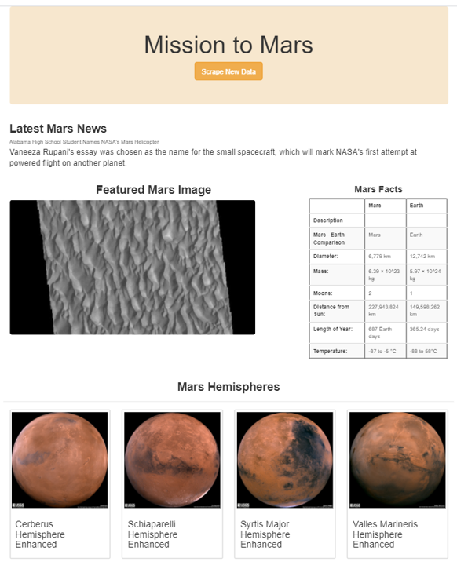
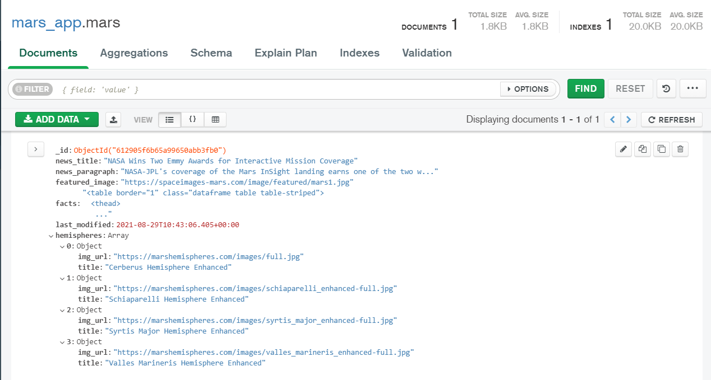

# Mission-to-Mars Challenge
###### Challenge Module 10
____________________________________________________

# Overview
Robin wants to have a website with the latest information about Mars. He scraped other web pages for different information.

Those web pages are:

- For latest news: *[Red Planet science](https://redplanetscience.com)*.
- For images: *[Space images](https://spaceimages-mars.com)*.
- For a comparative table Mars vs Earth: *[Galaxy facts](https://galaxyfacts-mars.com)*.
- For images of hemispheres: *[Mars hemispheres](https://marshemispheres.com)*. 

The following technology was used to make the website

- Splinter
- BeautifulSoup
- ChromeDriverManager
- Pandas
- MongoDB
- Bootstrap

# Results

A web page responsible:

### Desktop view

### Phone view

### Tablet view

# Summary

The scraping was successful, the browser bot took the information and added it to the mongo data base. It's possible to make improvements to the page.

### Data in mongoDB

